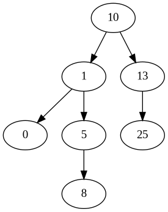
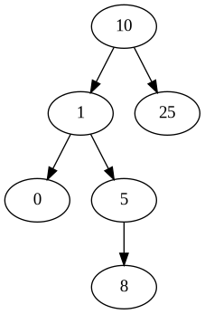
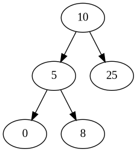
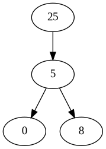
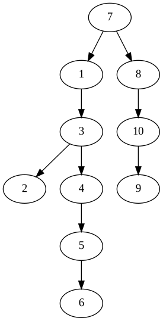
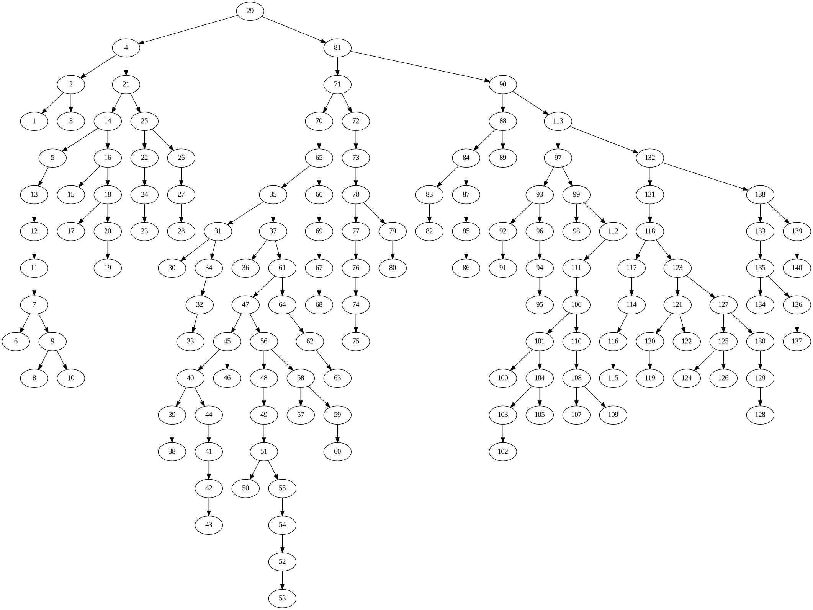

# BinTree

A `BinTree` is a structure used to represent the Binary Search Tree data type. A `BinTree` is a recursive structure that consists of a `key` field and two BinTree pointers, `right` and `left`.

```
typedef struct binary_tree_t {

    int key;
    struct binary_tree *right;
    struct binary_tree *left;

} BinTree;
```

### Instantiation

We can create a new BinTree node by calling `newBinTree`. This function creates a fresh BinTree node that can be used as the root of a Binary Tree.

```
BinTree *root = newBinTree(10) // Create a new BinTree whose key is 10
```

### Insertion

We can add on elements to the BinTree with `addKeyBST`. This will add a new node in the proper position to conform to the behavior of a Binary Search Tree.

```
addKeyBST(root,  1); // Adds 1 to the left of 10
addKeyBST(root, 13); // Adds 13 to the right of 10
addKeyBST(root,  0);
addKeyBST(root,  5); // Adds 5 to the right of 1
addKeyBST(root,  8);
addKeyBST(root, 25);
addKeyBST(root,  3);
```

### Visualization

A BinTree can be visualized using the `dot` language. We call the function `createDotBST` to output a new `.dot` file that encodes the connectivity of the tree. We can use a command of the form `dot -Tpng <my_input.dot> -o <my_output.png>` to create an image of the tree:


### Deletion

Deletion can be carried out with a simple call to `removeKeyBST`. Here, we will demonstrate the functionality of the function by showing the BST's connections after each operation.

```
removeKeyBST(root, 3);
```



```
removeKeyBST(root, 13);
```



```
removeKeyBST(root, 1);
```



With these three examples, I've implicitly displayed the 3 possible cases that we encounter when wanting to delete a node. In the first case, we have a node with no child elements. In the second case, we have a node with only one child. Finally, when removing the key 1, we observe that the node has two children. Each situation requires a different strategy for rearranging the tree to remove the intended node.

Removing the root node is actually just a special instance of the third case:

```
removeKeyBST(root, 10);
```




### Random Trees

We can start of with a shuffled set of the integers `{1, ..., N}` and create a `BinTree` from this data. To do so, simply call
`createRandomTree`:

```
BinTree *rando = createRandomTree(10);
createDotBST(rando, "rando.dot");
```

Now we can execute `dot -Tpng rando.dot -o rando.png` to create the following graph:



If we want to have some more fun, we can ramp up the `N` value in our call to `createRandomTree`. Let's check out a graph with `N = 140`.



Rad.