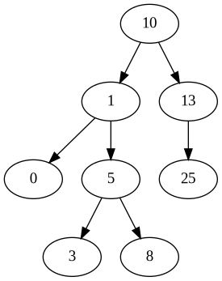

# BinTree

A `BinTree` is a structure used to represent the Binary Search Tree data type. A `BinTree` is a recursive structure that consists of a `key` field and two BinTree pointers, `right` and `left`.

```
typedef struct binary_tree_t {

    int key;
    struct binary_tree *right;
    struct binary_tree *left;

} BinTree;
```

### Instantiation

We can create a new BinTree node by calling `newBinTree`. This function creates a fresh BinTree node that can be used as the root of a Binary Tree.

```
BinTree *root = newBinTree(10) // Create a new BinTree whose key is 10
```

We can add on elements to the BinTree with `addKeyBST`. This will add a new node in the proper position to conform to the behavior of a Binary Search Tree.

```
addKeyBST(root,  1); // Adds 1 to the left of 10
addKeyBST(root, 13); // Adds 13 to the right of 10
addKeyBST(root,  0);
addKeyBST(root,  5); // Adds 5 to the right of 1
addKeyBST(root,  8);
addKeyBST(root, 25);
addKeyBST(root,  3);
```

### Visualization

A BinTree can be visualized using the `dot` language. We call the function `createDotBST` to output a new `.dot` file that encodes the connectivity of the tree. We can use a command of the form `dot -Tpng <my_input.dot> -o <my_output.png>` to create an image of the tree:

